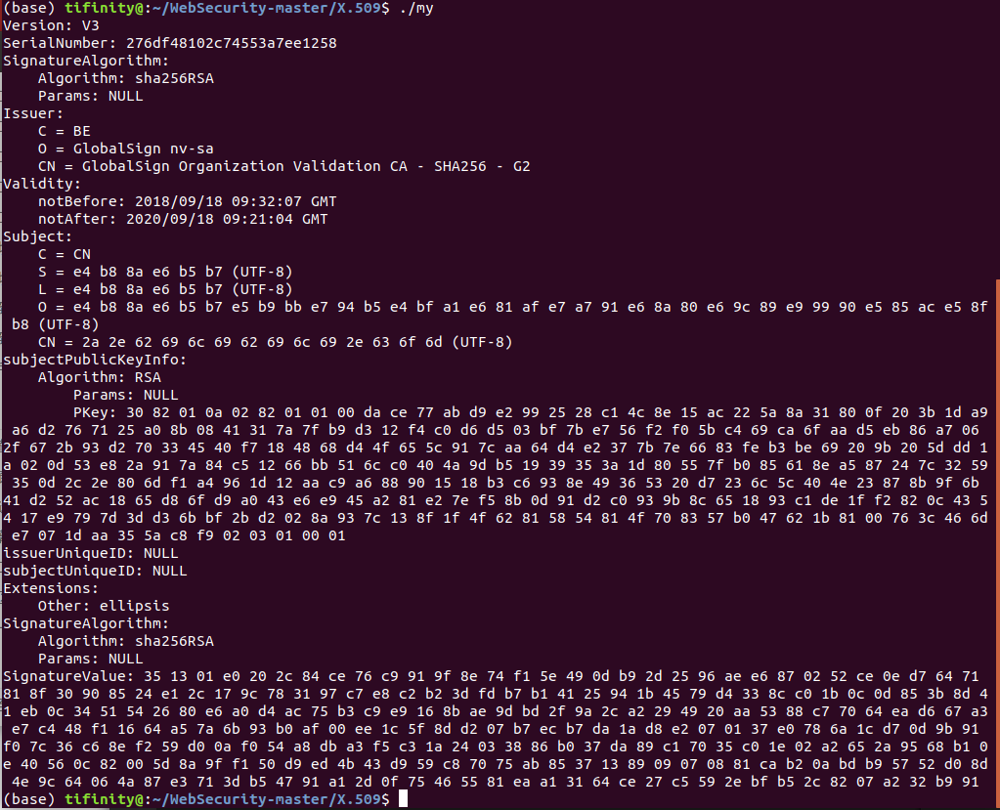

# X.509数字证书 	

17343105 田皓


## X.509证书结构描述

- 版本
- 序列号
- 算法ID
- 发行人（CA名称）
- 有效性
  - 此日期前无效
  - 此日期后无效
- 主题
- 主题公钥信息
  - 公钥算法
  - 主题公钥
- 颁发者唯一标识符（可选）
- 主题唯一标识符（可选）
- 扩展（可选）
- 证书签名算法
- 数字签名


1. 总体结构

        ```go
        Certificate ::= SEQUENCE {
            tbsCertificate       TBSCertificate,                       -- 证书主体
            signatureAlgorithm   AlgorithmIdentifier,     -- 证书签名算法标识
            signatureValue       BIT STRING                           -- 证书签名值,是使用signatureAlgorithm部分指定的签名算法对tbsCertificate证书主题部分签名后的值.
        }
        ```

    X.509 证书(Certificate)结构主要分成了三大部分:证书主体、证书签名算法标识、证书签
    名值三个部分。其中证书主体和证书签名算法标识的存储结构为结构体,证书签名值的存储
    格式为 BitString。


2. 具体结构

      - 证书主体
      
      ```go
      TBSCertificate ::= SEQUENCE {
          version         [0] EXPLICIT Version DEFAULT v1,          -- 证书版本号
          serialNumber         CertificateSerialNumber,             -- 证书序列号，对同一CA所颁发的证书，序列号唯一标识证书
          signature            AlgorithmIdentifier,                 -- 证书签名算法标识
          issuer               Name,                                -- 证书发行者名称
          validity             Validity,                            -- 证书有效期
          subject              Name,                                -- 证书主体名称
          subjectPublicKeyInfo SubjectPublicKeyInfo,                -- 证书公钥
          issuerUniqueID  [1] IMPLICIT UniqueIdentifier OPTIONAL,   -- 证书发行者ID(可选)，只在证书版本2、3中才有
          subjectUniqueID [2] IMPLICIT UniqueIdentifier OPTIONAL,   -- 证书主体ID(可选)，只在证书版本2、3中才有
          extensions      [3] EXPLICIT Extensions OPTIONAL          -- 证书扩展段（可选），只在证书版本3中才有
}
      ```
      
      ​		证书主体(TBSCertificate)结构分成了 10 个部分,包括了证书版本号、证书序列号、证书
      ​		签名算法标识、证书发行者名称、证书有效期、证书主体名称、证书公钥、证书发行者 ID、
      ​		证书主体 ID、证书扩展部分。
      
      - 证书版本号
      
        ```
        Version ::= INTEGER { v1(0), v2(1), v3(2) }                   -- 版本号（v1,v2,v3）
        ```
      
        证书版本号的存储结构为整型数。
      
      - 证书序列号
      
        ```
        CertificateSerialNumber ::= INTEGER                           -- 证书序列号存储结构
        ```
      
        证书序列号的存储结构为整型数。
      
      - 证书签名算法标识
      
        ```
        AlgorithmIdentifier ::= SEQUENCE {                            -- 签名算法标识存储结构
            algorithm               OBJECT IDENTIFIER,                -- 签名算法名称
            parameters              ANY DEFINED BY algorithm OPTIONAL -- 签名算法参数
        }
        ```
      
        证书签名算法标识的存储结构为 AlgorithmIdentifier,里面包含了算法名称和算法参数。算
        法名称使用 OID 结构保存,算法参数的存储结构为整型数。
      
      - 证书发行者名称
      
        ```
        Name ::= CHOICE {                                             -- 证书发行者名称存储结构
            RDNSequence
        }
        ```
      
        证书发行者名称、证书主体名称均使用 Name 结构体进行存储,包含了 OID 结构和其他自
        定义结构。
      
      - 证书有效期
      
        ```
        Validity ::= SEQUENCE {                                       -- 证书有效期存储结构
            notBefore      Time,                                      -- 证书有效期起始时间
            notAfter       Time                                       -- 证书有效期终止时间
        }
        ```
      
        证书有效期使用 Time 结构体进行存储。
      
      - 证书发行者ID,证书主体ID
      
        ~~~
        UniqueIdentifier ::= BIT STRING                               -- 证书唯一标识存储结构
        ~~~
      
        证书发行者 ID、证书主体 ID 使用 BitString 进行存储。
      
      - 证书公钥
      
        ~~~
        SubjectPublicKeyInfo ::= SEQUENCE {                           -- 证书公钥存储结构
            algorithm            AlgorithmIdentifier,                 -- 公钥算法
            subjectPublicKey     BIT STRING                           -- 公钥值
        }
        
        subjectPublicKey:                                             -- RSA算法时的公钥值
            RSAPublicKey ::= SEQUENCE { 
                 modulus            INTEGER,
                 publicExponent     INTEGER
            }
        ~~~
      
        证书公钥使用 AlgorithmIdentifier 和 BitString 组成的结构体进行存储。
      
      - 证书拓展部分
      
        ~~~
        Extensions ::= SEQUENCE SIZE (1..MAX) OF Extension            -- 拓展部分存储结构
            Extension ::= SEQUENCE {
                extnID      OBJECT IDENTIFIER,
                critical    BOOLEAN DEFAULT FALSE,
                extnValue   OCTET STRING
            }
        ~~~
      
        

## 编译运行结果



详见result/


